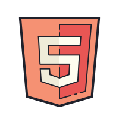
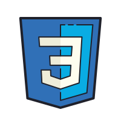
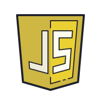
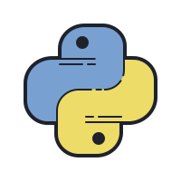
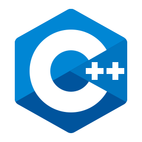
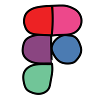

[](https://git.io/typing-svg)

<div align="center">


</div>

# Hey there, Abhijith here!  

## About Me👤: 
I'm Abhijith Shaji, a first year student at DCS CUSAT - Kochi pursuing five year majors in Computer Science specialised with AI & Data Science. With a keen interest and undying urge to learn, grow and a passion to connect... I'm always up to something or the other! Ping me and watch me sprouting, bit by commit 🤩.  

## Tech Stack🤖:
<div>
  
  
  
  
  
  
  
  
  <br>
  
  
  </br>
</div>

## Overall Stats📈:

<div align="center">


</div>

<div align="center">


</div>

<div align="center">


</div>

<div align="center">

```diff
+@ @ @ @ @ @ @ @ @ @ @ @ @ @ @ @ @ @ @ @ @ @ @ @ @ @ @ @+
@@       o o                                           @@
@@       | |                                           @@
@@      _L_L_                                          @@
@@   ❮\/__-__\/❯ Programming isn't about what you know @@
@@   ❮(|~o.o~|)❯  It's about what you can figure out   @@
@@   ❮/ \`-'/ \❯                                       @@
@@     _/`U'\_                                         @@
@@    ( .   . )     .----------------------------.     @@
@@   / /     \ \    | while( ! (succed=try() ) ) |     @@
@@   \ |  ,  | /    '----------------------------'     @@
@@    \|=====|/                                        @@
@@     |_.^._|                                         @@
@@     | |"| |                                         @@
@@     ( ) ( )   Testing leads to failure              @@
@@     |_| |_|   and failure leads to understanding    @@
@@ _.-' _j L_ '-._                                     @@
@@(___.'     '.___)                                    @@
+@ @ @ @ @ @ @ @ @ @ @ @ @ @ @ @ @ @ @ @ @ @ @ @ @ @ @ @+
```
  
</div>

